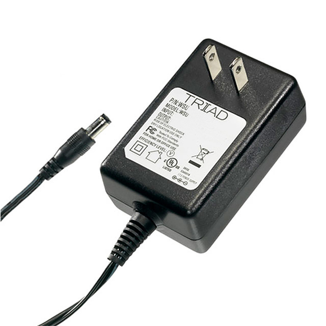
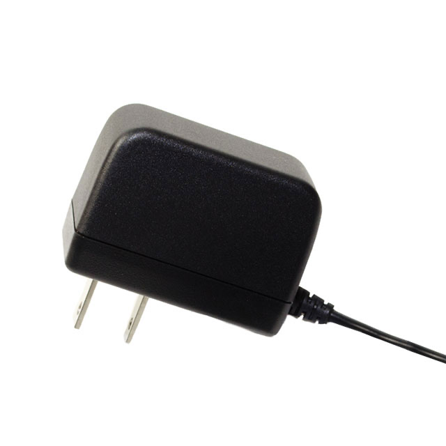
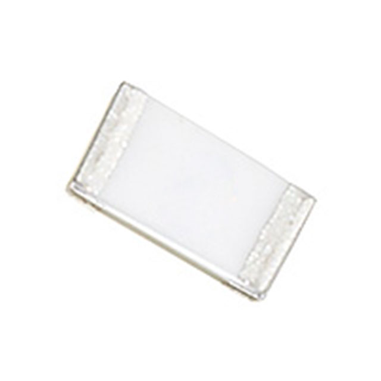
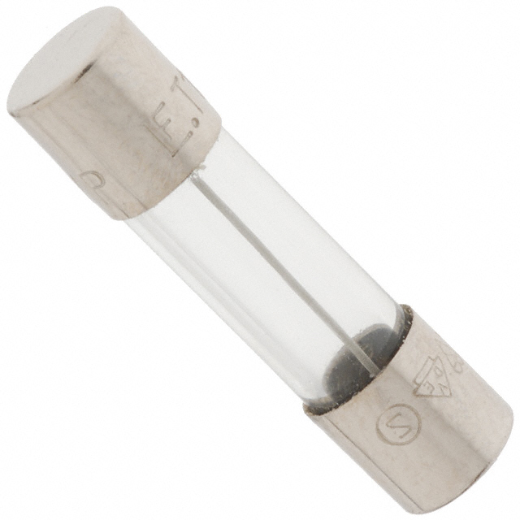
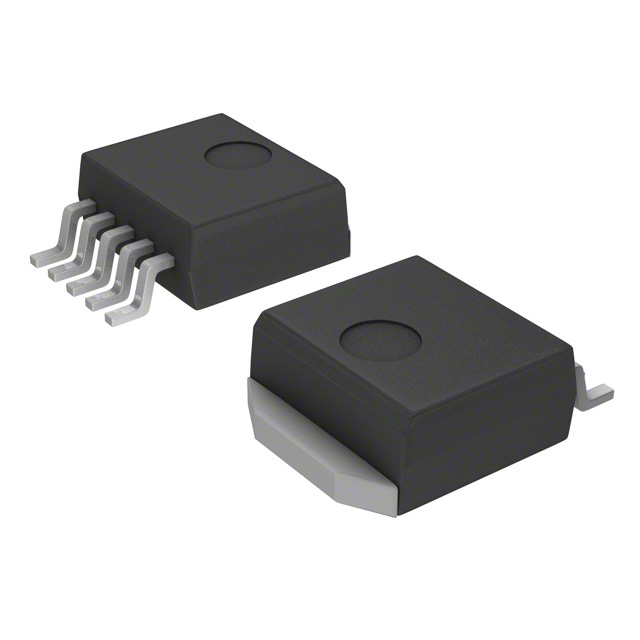

**Display(OLED/LCD)**

| **Parts Choosen**                                                                                                                                                                                      | **Pros**                                                                                                                                    | **Cons**                                                                                            |
| ------------------------------------------------------------------------------------------------------------------------------------------------------------------------------------------------- | ------------------------------------------------------------------------------------------------------------------------------------------- | --------------------------------------------------------------------------------------------------- |
|  Option 1.  NHD-C12832A1Z-FSW-FBW-3V3 $12.78/each [link to product](https://www.digikey.com/en/products/detail/newhaven-display-intl/NHD-C12832A1Z-FSW-FBW-3V3/2059236)                 | \* inexpensive for just one \* Compatible with other subsystems \* Will be on exterior of device                                               | \* Might be too big for device \* Might require external power. |
|  \* Option 2.  \* NHD-C12864GG-RN-GBW  \* $13.32/each  \* [Link to product](https://www.digikey.com/en/products/detail/newhaven-display-intl/NHD-C12864GG-RN-GBW/1701323) | \* small enough to fit on robot  \* Stable over operating temperature  \ | * More expensive  \* shipping speed varies                                                         |

**Choice:** Option 1: SSD1306 0.96" OLED

**Rationale:** Option 1 is the best choice since it is big enough to fit on the device. It will operate and show exactly what needs to be shown, it is also very clear as a display. What is shown on the display is very simple. 

**Power Source**

| **Parts Choosen**                                                                                                                                                                                      | **Pros**                                                                                                                                    | **Cons**                                                                                            |
| ------------------------------------------------------------------------------------------------------------------------------------------------------------------------------------------------- | ------------------------------------------------------------------------------------------------------------------------------------------- | --------------------------------------------------------------------------------------------------- |
|  Option 1.  364-1254-ND $6.46/each [link to product](https://www.digikey.lv/en/products/detail/triad-magnetics/WSU120-0700/3094979)                 | \* inexpensive for just one \* Compatible with other subsystems \* Up to 12V/8.4W                                               | \* expensive if need more in quantity  \* shipping speed varies. |
|  \* Option 2.  \* SWI3-5-N-MUB  \* $4.69/each  \* [Link to product](https://www.digikey.lv/en/products/detail/cui-inc/SWI3-5-N-MUB/7784529) | \* cheaper  \* Stable over operating temperature  \ | * output of 5V only  \* shipping speed varies                                                         |

**Choice:** Option 1: 364-1254-ND

**Rationale:** Option 1 is the best choice since it outputs 12V and will not make the subsystem falter in performance. 

**Fuses**

| **Parts Choosen**                                                                                                                                                                                      | **Pros**                                                                                                                                    | **Cons**                                                                                            |
| ------------------------------------------------------------------------------------------------------------------------------------------------------------------------------------------------- | ------------------------------------------------------------------------------------------------------------------------------------------- | --------------------------------------------------------------------------------------------------- |
|  Option 1.  C1F 8 $0.34/each [link to product](https://www.digikey.com/en/products/detail/bel-fuse-inc/C1F-8/4968262)                 | \* inexpensive for a bunch \* up to 8A \* Can handle the power going through the subsystem                                               | \* might not be enough for power  \* might burn up during use. |
|  \* Option 2.  \* 0217002.MXP  \* $0.44/each  \* [Link to product](https://www.digikey.com/en/products/detail/littelfuse-inc/0217002-MXP/777545) | \* goes up to 2A  \* Stable over operating temperature  \ | * might be too small for subsystem  \* shipping speed varies                                                         |

**Choice:** option 2: C1F(fuse)

**Rationale:** Option 2 is the best choice cause it is a simple check in the subsystem and does not provide an importance in the subsystem, so 8A is more than enough, and it is small so it wont take up too much space.

**Voltage Regulator**

| **Parts Choose**                                                                                                                                                                                      | **Pros**                                                                                                                                    | **Cons**                                                                                            |
| ------------------------------------------------------------------------------------------------------------------------------------------------------------------------------------------------- | ------------------------------------------------------------------------------------------------------------------------------------------- | --------------------------------------------------------------------------------------------------- |
|  Option 1.  LM2575D2T-3.3R4G $3.32/each [link to product](https://www.digikey.com/en/products/detail/onsemi/LM2575D2T-3-3R4G/1476688)                 | \* inexpensive for just one so multiple can be bought incase \* Compatible with other subsystems \* Input voltage is 4.75V and output can go up to 40V and current output is 1A                                               | \* Could burn out but very low chance \. |                                                        

**Choice:** Option 1: LM2575D2T-3.3R4G

**Rationale:** Option 1 is the only one I could find that will work for this subsystem. And is compatible with all other parts also and other subsystems. 

**Microcontroller**

| **Parts Choose**                                                                                                                                                                                      | **Pros**                                                                                                                                    | **Cons**                                                                                            |
| ------------------------------------------------------------------------------------------------------------------------------------------------------------------------------------------------- | ------------------------------------------------------------------------------------------------------------------------------------------- | --------------------------------------------------------------------------------------------------- |
|  Option 1.  ESP32-S3-WROOM-1-N4 $5.06/each [link to product]((https://www.digikey.com/en/products/detail/espressif-systems/ESP32-S3-WROOM-1-N4/16162639))                 | \* inexpensive for just one so multiple can be bought incase \* Compatible with other subsystems \* easier to code                                               | \* Could burn out but very low chance, also communication with PIC maybe difficult. \. |                                                        

**Choice:** Option 1: ESP32-S3-WROOM-1-N$

**Rationale:** Option 1 is the only one I could find that will work for this subsystem. And is compatible with all other parts also and other subsystems. And like previously it is easier to code on the ESP than the PIC.
