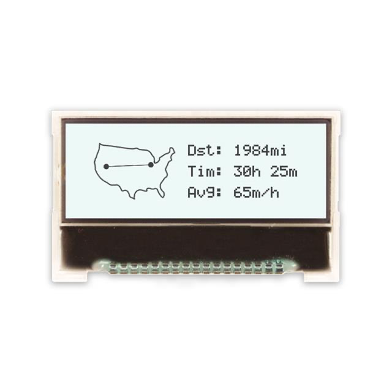
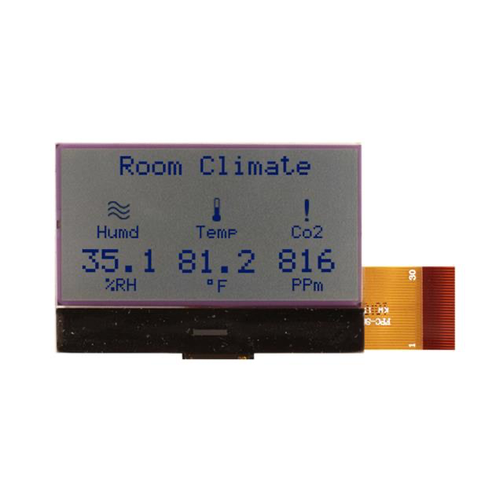

**Display(OLED/LCD)**

| **Parts Choosen**                                                                                                                                                                                      | **Pros**                                                                                                                                    | **Cons**                                                                                            |
| ------------------------------------------------------------------------------------------------------------------------------------------------------------------------------------------------- | ------------------------------------------------------------------------------------------------------------------------------------------- | --------------------------------------------------------------------------------------------------- |
|  Option 1.  NHD-C12832A1Z-FSW-FBW-3V3 $12.78/each [link to product](https://www.digikey.com/en/products/detail/newhaven-display-intl/NHD-C12832A1Z-FSW-FBW-3V3/2059236)                 | \* inexpensive for just one \* Compatible with other subsystems \* Will be on exterior of device                                               | \* Might be too big for device \* Might require external power. |
|  \* Option 2.  \* NHD-C12864GG-RN-GBW  \* $13.32/each  \* [Link to product](https://www.digikey.com/en/products/detail/newhaven-display-intl/NHD-C12864GG-RN-GBW/1701323) | \* small enough to fit on robot  \* Stable over operating temperature  \ | * More expensive  \* shipping speed varies                                                         |

**Choice:** Option 1: SSD1306 0.96" OLED

**Rationale:** Option 1 is the best choice since it is big enough to fit on the device. It will operate and show exactly what needs to be shown, it is also very clear as a display. What is shown on the display is very simple. 

**Power Source**

| **Parts Choosen**                                                                                                                                                                                      | **Pros**                                                                                                                                    | **Cons**                                                                                            |
| ------------------------------------------------------------------------------------------------------------------------------------------------------------------------------------------------- | ------------------------------------------------------------------------------------------------------------------------------------------- | --------------------------------------------------------------------------------------------------- |
|  Option 1.  364-1254-ND $6.46/each [link to product](https://www.digikey.lv/en/products/detail/triad-magnetics/WSU120-0700/3094979)                 | \* inexpensive for just one \* Compatible with other subsystems \* Up to 12V/8.4W                                               | \* expensive if need more in quantity  \* shipping speed varies. |
|  \* Option 2.  \* SWI3-5-N-MUB  \* $4.69/each  \* [Link to product](https://www.digikey.lv/en/products/detail/cui-inc/SWI3-5-N-MUB/7784529) | \* cheaper  \* Stable over operating temperature  \ | * output of 5V only  \* shipping speed varies                                                         |

**Choice:** Option 1: 364-1254-ND

**Rationale:** Option 1 is the best choice since it outputs 12V and will not make the subsystem falter in performance. 
